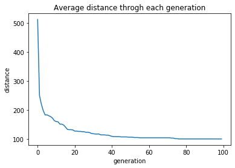
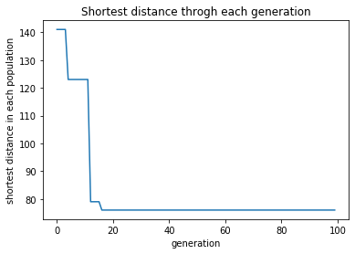

# Simple Genetic Algorithm for path-finding problem

I used the basic concept of GA to minimize the distance in pathfinding problems. Here are some results showing how the average 
distance and minimum distance changed with each generation. I used 90% crossover and 10% mutation throughout the evolution 
process. The distance values I used in this example are between 0 to 100, and 50% nodes are connected. 
The Genetic Algorithm path finding is a part of the path planner that also uses Dijkstra, A*, AGA, etc 

## Average distance change with each generation


## Best individual's evolution with each generation


# Simple Genetic Algorithm (SGA) for Path-Finding

Find a near-optimal path from **Start (S)** to **Goal (G)** on a grid/maze with obstacles using a classic Genetic Algorithm.

> Compact, easy to read, and ready to run for coursework, demos, or as a baseline.

---

## ✨ What it does
- Searches a 2D grid for a collision-free path.
- Optimizes path **length** + **collision penalties**.
- Supports **cardinal** (UDLR) or **8-directional** moves.
- Works with fixed-length genomes or variable-length with pruning.

---

## 🔧 Problem Format
- Grid file (text or CSV): `0` = free, `1` = obstacle.
- Config JSON (optional): start, goal, GA params.

**Example grid.txt**
0 0 0 0 0
0 1 1 0 0
0 0 0 0 0
0 0 1 1 0
S 0 0 0 G

---

## 🧬 Algorithm (SGA)
- **Encoding**: chromosome = sequence of moves, e.g. `UDLR` (4-dir) or `UDLRDGSH` (8-dir).
- **Init**: random valid/biased paths (optionally via jitter around shortest-line).
- **Fitness** (to **maximize**):  
  `fitness = - path_length  - α * collisions  - β * manhattan_to_goal_end  - γ * turns`
- **Selection**: tournament or roulette.
- **Crossover**: 1-point or 2-point with repair (trim out-of-bounds tails).
- **Mutation**: random move flip / insert/delete (with bounds & obstacle checks).
- **Elitism**: keep best `k` each generation.
- **Stop**: max generations or goal reached with no collisions.

---

## ⚙️ Parameters (defaults)
```json
{
  "population": 200,
  "generations": 300,
  "genome_length": 2_5x_grid_perimeter,   // rule of thumb
  "move_set": "8dir",                      // "4dir" or "8dir"
  "selection": { "type": "tournament", "k": 3 },
  "crossover_rate": 0.9,
  "mutation_rate": 0.1,
  "elitism": 2,
  "alpha_collision": 1000,
  "beta_goal_dist": 5,
  "gamma_turns": 0.2,
  "seed": 42
}
from sga import GAPathFinder, load_grid

grid = load_grid("data/grid.txt")
ga = GAPathFinder(grid, start=(0,0), goal=(4,4), move_set="8dir")
best = ga.run(population=200, generations=300, seed=42)
print("Cost:", best. cost, "Reached:", best.reached_goal)
ga.plot(best)  # optional
